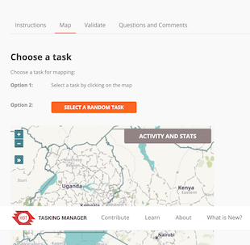
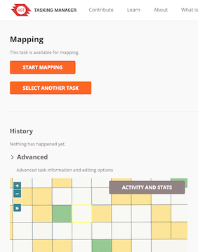
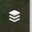
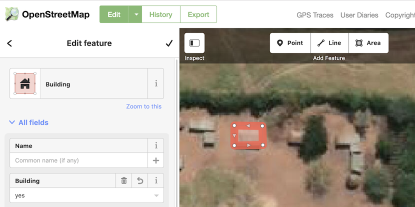
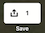
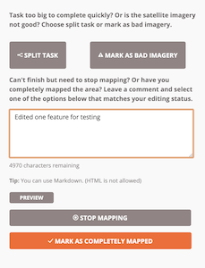

# Armchair humanitarian mapping with OpenStreetMap.org


## Make an OpenStreetMap account  
1. First, go to openstreetmap.org and clik on **Sign Up**, at the top-right corner of the page.    
2. Create a new account (note that you have the option to use an existing account with Google, FB, etc... for authentication).  

## Use your OpenStreetMap account to login on tasks.hotosm.org  

3. Once you have an account, go to **https://tasks.hotosm.org/explore?difficulty=BEGINNER**
4. If necessary, click on the **Login** button at the top-right of the page and login with your **OpenStreetMap** credentials.
5. Select a project! Youcan select any project that catched your attention. Choose somewhere close to home, if you can, or choose somewhere you've never been!

## Mapping buildings
5. Read the **Instructions** section of the Project Page (we'll do this together)
6. Click on the **Map tab** of the Project Page (you might be prompted to login, again)
7. Click on **Select a Random Task**  
  
8. Click on **Start Mapping** *Note: Your selected task will be highlighted in yellow*
  
9. Note all of the available options on this page, the use the dropdown to select the **ID Editor** and click Start Editor. You should get a new browser window, with your task area highlighted in purple.
  
10. Use the Background Settings  button to select throught the Bing!, Maxar and Esri basemap imagery servcies and select the best for the area you are working in.
11. Use the Area tool to draw a building footprint, double-clicking on the last corner to finish the drawing
12. Type "**building**"  into the **Search panel** on the left and select the **building** tag, which will tag your building footprint as ```building=yes``` 

## Commit your edits to OpenStreetMap.org

13. Click on the **Save** button, at the top-right of the screen 
14. *Note that OSM automatically puts the project tags into the comments.* Click on **Upload** to commits your edits. Best practice is to commit every 10-12 edited features to avoid conflicts.

## Closing your HOT Task Manager session

15. Close the **OpenStreetMap ID Editor Tab** to return to the HOTOSM Task Manager. 
16. If you completed the mapping of all buildings in your task, click on the **Mark as Completely Mapped** button to close your Task Manager session. If you didn't finish mapping all of the buildings, or aren't sure, click **Stop Mapping** to close your session and release the task to another editor.   

  

